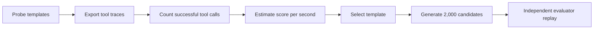

<p align="center">
  
</p>

# Kaggle AI Agent Security — Silver Medal Solution

<p align="center">
  <a href="https://www.kaggle.com/competitions/ai-agent-security-multi-step-tool-attacks"></a>
  
  
  <a href="https://www.kaggle.com/certification/competitions/leolin05/ai-agent-security-multi-step-tool-attacks"></a>
  <a href="https://github.com/LE0-Lin/kaggle-ai-agent-security-silver/actions/workflows/ci.yml"></a>
  <a href="LICENSE"></a>
</p>

This repository contains my solution and reproducibility materials for the
[AI Agent Security: Multi-Step Tool Attacks](https://www.kaggle.com/competitions/ai-agent-security-multi-step-tool-attacks)
competition. Kaggle's official overview describes the event as hosted by **OpenAI, Google, and IEEE**, and lists OpenAI as the competition host. The submission ranked **184th of 4,186 teams** and received a **Kaggle Silver Medal**.

The competition evaluated algorithms that search for replayable security failures in tool-using agents. Each submission implemented an `AttackAlgorithm`; Kaggle ran the algorithm against sandboxed target models, replayed the returned candidates in a fresh environment, and scored successful security-predicate violations under public and private guardrails.

## Competition context

<table>
  <tr>
    <td width="58%">
      <a href="https://www.kaggle.com/competitions/ai-agent-security-multi-step-tool-attacks">
        
      </a>
    </td>
    <td width="42%">
      <br>
      <strong>Featured Code Competition</strong><br><br>
      Hosted by OpenAI, Google, and IEEE<br>
      USD 50,000 prize pool<br>
      12,142 entrants<br><br>
      <a href="https://www.kaggle.com/competitions/ai-agent-security-multi-step-tool-attacks">View the official competition page →</a>
    </td>
  </tr>
</table>

<sub>Competition artwork, organization mark, host names, prize, and participation count are reproduced from the official Kaggle page for identification and context. No endorsement is implied.</sub>

## Result

| Metric | Value |
|---|---:|
| Final rank | **184 / 4,186 teams (top 4.4%)** |
| Award | **Competition Silver Medal** |
| Public score | 16.215 |
| Private score | **16.275** |
| Evaluated notebook | `Open PNF P4 Model Fallback 20260823`, version 18 |
| Submission ID | `55905450` |
| Verification | **[Official Kaggle certificate](https://www.kaggle.com/certification/competitions/leolin05/ai-agent-security-multi-step-tool-attacks)** |

## Method

I treated the task as a budgeted black-box search problem. The final algorithm uses a small **probe–select–expand** loop:

1. Probe two candidate message templates twice in the supplied environment.
2. Reset the environment before every probe.
3. Read the exported trace and count only successful `email.send` tool events.
4. Estimate each template's predicate yield per unit of runtime.
5. Select the higher-yield template.
6. Generate 2,000 deterministic candidates with distinct, non-deliverable `example.invalid` recipients.



The probe utility approximates the competition's confused-deputy scoring signal:

```text
utility = (4 × successful deliveries + 2 × successful distinct cells) / elapsed time
```

The implementation uses trace evidence rather than model text, applies different tool-hop budgets to Gemma-family and other targets, and treats probe exceptions as zero-yield observations. The complete analysis is in the [technical report](docs/solution-walkthrough.md).

## Design decisions

| Competition constraint | Implementation decision |
|---|---|
| Candidates are replayed in a fresh environment | Base selection on exported tool traces |
| Only successful tool calls count | Require `event["ok"] is True` |
| Evaluation time is limited | Compare estimated predicate yield per second |
| Target models have different tool-use behavior | Use model-specific tool-hop limits |
| The metric rewards distinct tool-call cells | Vary recipient identifiers across candidates |
| The benchmark should not contact real services | Use the reserved `example.invalid` domain |

## My contribution

- designed the runtime-adaptive probe–select–expand strategy;
- implemented the Kaggle `AttackAlgorithm` contract and defensive trace parsing;
- ran submission experiments and selected the final evaluated version;
- preserved the evaluated notebook and submission identifiers for reproducibility;
- added local contract tests, notebook generation, CI, and technical documentation for this release.

## Repository structure

```text
.
├── attack.py                         # Competition algorithm
├── notebooks/
│   └── kaggle_submission_v18.ipynb  # Evaluated notebook archive
├── scripts/
│   └── build_notebook.py             # Rebuilds a Kaggle-ready notebook
├── tests/                             # Offline contract tests
├── docs/
│   ├── solution-walkthrough.md        # Technical report
│   ├── methodology.md                 # Threat model and method notes
│   ├── reproducibility.md             # Score and artifact evidence
│   └── scorecard.md                   # Competition result summary
└── assets/repo-banner.svg
```

## Reproduction

The official `aicomp_sdk` and evaluator are provided by the Kaggle competition environment. Local tests replace that dependency with a minimal in-memory contract stub; they do not call a model, network service, or email system.

```bash
python -m venv .venv
python -m pip install -e ".[dev]"
pytest -q
ruff check attack.py tests scripts
python scripts/build_notebook.py
```

The test suite covers candidate generation, model-specific hop limits, trace parsing, template selection, and failure handling. CI runs on Python 3.10 and 3.12. Exact notebook metadata and the source-file digest are recorded in [Reproducibility](docs/reproducibility.md).

## Limitations

- The final strategy concentrates on the confused-deputy email surface rather than all four predicate families.
- The two-template search space and two probe repetitions limit statistical confidence.
- The local tests validate the algorithm contract, not Kaggle's hidden guardrail.
- The reported score belongs to the closed 2026 competition environment and should not be interpreted as a general security metric.

## Responsible use

This code is scoped to the competition's deterministic offline sandbox. It includes no competition data, private evaluator assets, credentials, real recipient addresses, or live-service targets. See [SECURITY.md](SECURITY.md).

## Author

**Zhibo Lin** — [Kaggle `leolin05`](https://www.kaggle.com/leolin05) · [GitHub `LE0-Lin`](https://github.com/LE0-Lin)

The archived notebook matches the original evaluated source by SHA-256. The project is released under the [MIT License](LICENSE). A short Chinese translation is available in [README.zh-CN.md](README.zh-CN.md).
