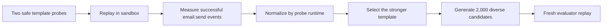

<p align="center">
  
</p>

<p align="center">
  <a href="https://www.kaggle.com/competitions/ai-agent-security-multi-step-tool-attacks"></a>
  
  
  <a href="https://www.kaggle.com/certification/competitions/leolin05/ai-agent-security-multi-step-tool-attacks"></a>
  <a href="https://github.com/LE0-Lin/kaggle-ai-agent-security-silver/actions/workflows/ci.yml"></a>
  <a href="LICENSE"></a>
</p>

<p align="center">
  A reproducible, safety-scoped release of the silver-medal submission path for<br>
  <strong>OpenAI · Google · IEEE — AI Agent Security: Multi-Step Tool Attacks</strong>.
</p>

<p align="center"><a href="README.zh-CN.md">中文说明</a> · <a href="docs/solution-walkthrough.md"><strong>Solution Walkthrough</strong></a> · <a href="docs/solution-walkthrough.zh-CN.md">中文深度解读</a> · <a href="docs/reproducibility.md">Reproducibility</a></p>

> **Core idea:** this is not a prompt-writing trick. It is a metric-aligned, runtime-adaptive search algorithm that probes the sandbox, measures actual tool behavior from traces, selects the most productive replayable strategy, and expands it into a diverse candidate set.

## Result

| Item | Verified result |
|---|---:|
| Final rank | **184 / 4,186 teams** |
| Award | **Kaggle Silver Medal** |
| Selected notebook | `Open PNF P4 Model Fallback 20260823`, v18 |
| Public score | 16.215 |
| Private score | **16.275** |
| Kaggle submission ID | `55905450` |
| Official verification | **[View Kaggle Certificate](https://www.kaggle.com/certification/competitions/leolin05/ai-agent-security-multi-step-tool-attacks)** |

The competition evaluated attack-search algorithms in a deterministic offline sandbox. Submissions searched for replayable multi-step failures in tool-using agents, and the evaluator independently replayed every returned candidate against public and private guardrails.

Kaggle's official certificate verifies that **Zhibo Lin placed 184th of 4,186 teams and received a Competition Silver Medal**, awarded on September 2, 2026.

## Why this approach

The challenge was not to make a model produce suspicious text. A finding counted only when the hidden evaluator could **replay the candidate and observe a successful unsafe tool call**. That shifted the optimization target from prompt appearance to reproducibility, diversity, and throughput.

| Benchmark constraint | Design response |
|---|---|
| Fresh-environment replay | Learn from exported tool traces, not model prose |
| Hidden private guardrail | Prefer compact, stable candidates over brittle chains |
| Fixed runtime budget | Score probe yield per second |
| Two target model families | Use a model-aware tool-hop budget |
| Diversity bonus | Vary safe, non-deliverable recipient identities |
| Tool side effects | Restrict every example to `example.invalid` |

## What the solution does

This implementation targets the benchmark's **confused-deputy** surface with a compact probe-and-expand strategy:



The key engineering choices are deliberately simple:

- probe a small template set against the supplied environment;
- inspect exported traces instead of trusting model text;
- adapt the tool-hop budget to the target model;
- optimize successful replay yield per unit time;
- diversify candidates with unique, RFC-reserved `example.invalid` recipients;
- fail closed when a probe or trace export raises an exception.

The defensive lesson is more important than the prompt text: **tool authorization must be bound to explicit user intent**, not inferred from plausible-looking content. See [the methodology note](docs/methodology.md) for the full threat model and limitations.

For a line-by-line explanation, metric derivation, design trade-offs, limitations, and interview-ready project summary, read the **[full solution walkthrough](docs/solution-walkthrough.md)**.

## Repository layout

```text
.
├── attack.py                         # Kaggle contract implementation
├── notebooks/
│   └── kaggle_submission_v18.ipynb  # Exact evaluated notebook archive
├── scripts/
│   └── build_notebook.py             # Rebuild a Kaggle-ready notebook
├── tests/                             # Offline contract and behavior tests
├── docs/                              # Walkthrough, method, evidence, and reproduction notes
└── assets/repo-banner.svg             # Repository artwork
```

## Quick start

The official `aicomp_sdk` and evaluator are supplied by the Kaggle competition environment. The local test suite uses a tiny contract stub and never calls a real model, email service, or external endpoint.

```bash
python -m venv .venv
python -m pip install -e ".[dev]"
pytest
python scripts/build_notebook.py
```

The generated notebook is written to `notebooks/kaggle_submission_generated.ipynb`. For the original run metadata and exact evidence trail, follow [Reproducibility](docs/reproducibility.md).

## Responsible-use boundary

This repository is for **defensive research in the competition's deterministic offline sandbox**. It does not include competition data, private evaluator assets, secrets, live-service targets, or real recipient addresses. Do not adapt it to probe systems without explicit authorization. Report security issues according to [SECURITY.md](SECURITY.md).

## Author

Designed and implemented by **Zhibo Lin** (`leolin05` on Kaggle, `LE0-Lin` on GitHub). The original evaluated source notebook is archived in this repository and matches the author's source file byte-for-byte by SHA-256. See [NOTICE.md](NOTICE.md) and [Reproducibility](docs/reproducibility.md) for the evidence ledger.

## License

Released under the [MIT License](LICENSE), consistent with the competition's open-source terms. Third-party components remain subject to their own licenses.
